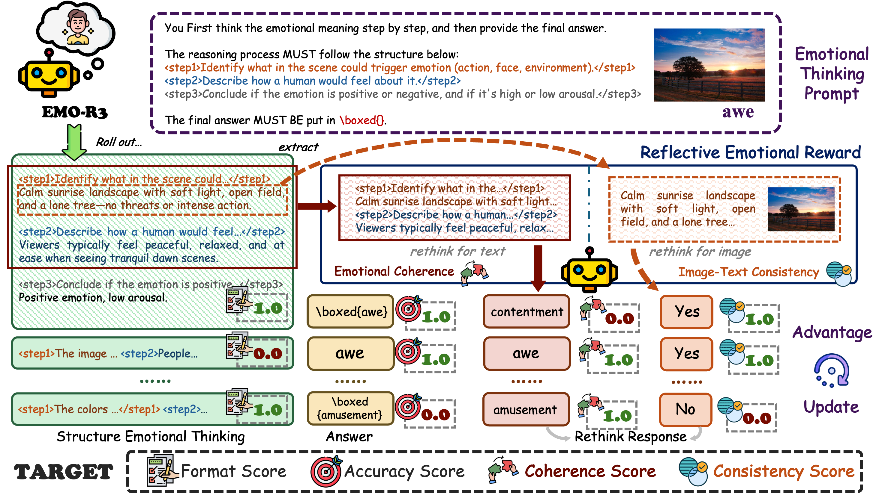

<h1 align="center">EMO-R3: Reflective Reinforcement Learning for Emotional Reasoning in Multimodal Large Language Models
</h1>

<p align="center"><em><strong>Yiyang Fang, Wenke Huang, Pei Fu, Yihao Yang, Kehua Su, Zhenbo Luo, Jian Luan, Mang Ye</strong></em></p>

<p align="center">
<a href="https://arxiv.org/abs/2602.23802"></a>


<div align="center">

</div>

## Abstract

Multimodal Large Language Models (MLLMs) have shown remarkable progress in visual reasoning and understanding tasks but still struggle to capture the complexity and subjectivity of human emotions. Existing approaches based on supervised fine-tuning often suffer from limited generalization and poor interpretability, while reinforcement learning methods such as Group Relative Policy Optimization fail to align with the intrinsic characteristics of emotional cognition. To address these challenges, we propose Reflective Reinforcement Learning for Emotional Reasoning (EMO-R3), a framework designed to enhance the emotional reasoning ability of MLLMs. Specifically, we introduce Structured Emotional Thinking to guide the model to perform step-by-step emotional reasoning in a structured and interpretable manner, and design a Reflective Emotional Reward that enables the model to re-evaluate its reasoning based on visual-text consistency and emotional coherence. Extensive experiments demonstrate that EMO-R3 significantly improves both the interpretability and emotional intelligence of MLLMs, achieving superior performance across multiple visual emotional understanding benchmarks.


## Preparation
1. Clone this repository.
```Shell
git clone https://github.com/SeerRay-Lab/emo-r3.git
cd emo-r3
```

2. Create the enviroment.
```Shell
conda create -n emo_r3 python=3.10
conda activate emo_r3
```

3. Install dependencies
```Shell
pip install --no-cache-dir "vllm==0.8.4" "torch==2.6.0" "torchvision==0.21.0" "torchaudio==2.6.0" "tensordict==0.9.1" torchdata \
    "transformers[hf_xet]==4.52.4" accelerate datasets peft hf-transfer \
    "numpy<2.0.0" "pyarrow>=15.0.0" "grpcio>=1.62.1" "optree>=0.13.0" pandas \
    "ray[default]" codetiming hydra-core pylatexenc qwen-vl-utils wandb liger-kernel mathruler \
    pytest yapf py-spy pyext pre-commit ruff

pip install flash-attn==2.7.4.post1 --no-build-isolation
pip install flashinfer-python==0.2.2
```

## Usage
1. Configure paths
Update the relevant paths in the scripts according to your environment.

2. Run training.
```Shell
bash example/qwen2_5_vl_3b_emor3.sh
```

3. Merge the model
```Shell
bash script/merge.sh
```


## 🥳 Citation

Please kindly cite this paper in your publications if it helps your research:

```bibtex
@article{fang2026emo,
  title={EMO-R3: Reflective Reinforcement Learning for Emotional Reasoning in Multimodal Large Language Models},
  author={Fang, Yiyang and Huang, Wenke and Fu, Pei and Yang, Yihao and Su, Kehua and Luo, Zhenbo and Luan, Jian and Ye, Mang},
  journal={arXiv preprint arXiv:2602.23802},
  year={2026}
}
```